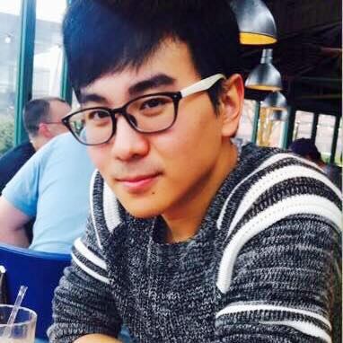

#

#

My name is Junrui Di (Simplified Chinese: 邸俊瑞). I'm a $4^{th}$ year PhD Candidate at the [Johns Hopkins Bloomberg School of Public Health](http://www.jhsph.edu/) [Department of Biostatistics](http://www.jhsph.edu/departments/biostatistics/). 

I am a science enthusiastic and fan of data. I enjoy solving scientific problems with the help of statistics.  My philosophy is: data is powerful cause it tells the truth.

In my spare time, I am a music lover and singer. 

 
 
 

##Education
- __Ph.D.__ Johns Hopkins Bloomberg School of Public Health, Biostatistics
- __M.Sc__ Georgetown Univeristy, Biostatistics
- __B.A.__ University of California, Berkeley, Applied Mathematics

 

##Latest News
- July 27. Come to my talk at  [IAGG 2017](https://www.iagg2017.org/) located in San Fransico this year. 

- June 21 - 23. Come to meet me and see my talk at  [ICAMPAM 2017](http://www.ismpb.org/program/) located in Bethesda this year.

- June 15. We are in press with our paper! 19-year-olds as sedentary as 60-year-olds, big surprise? [Read more](http://health.usnews.com/health-care/articles/2017-06-16/are-us-teens-now-as-inactive-as-60-year-olds).

- May 24. Linlin and I got married!!! It is time to start our new journey! [Read more](https://www.facebook.com/photo.php?fbid=1493877350662489&set=a.297027860347450.80245.100001207161317&type=3&theater). 

- May 22. I received the Louis I. Dublin and Thomas D. Dublin Award. [Read more](https://www.jhsph.edu/about/honors-and-awards/index.html).
