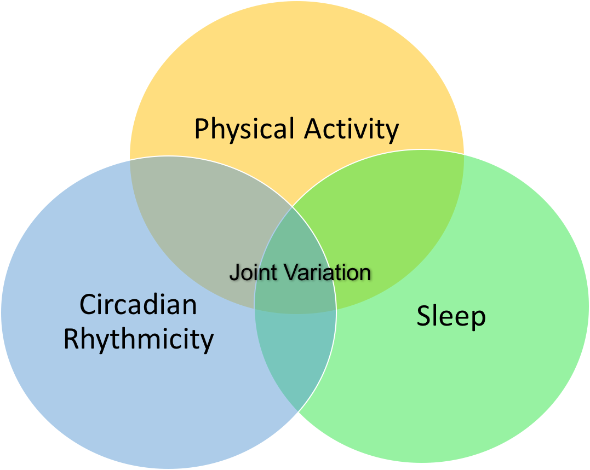
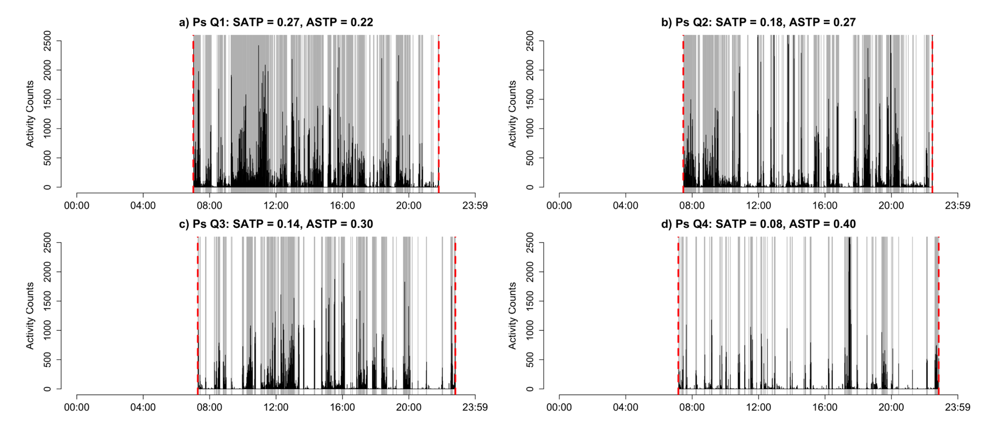

<link rel="stylesheet" href="academicons/css/academicons.min.css"/>

<script>
  (function(i,s,o,g,r,a,m){i['GoogleAnalyticsObject']=r;i[r]=i[r]||function(){
  (i[r].q=i[r].q||[]).push(arguments)},i[r].l=1*new Date();a=s.createElement(o),
  m=s.getElementsByTagName(o)[0];a.async=1;a.src=g;m.parentNode.insertBefore(a,m)
  })(window,document,'script','https://www.google-analytics.com/analytics.js','ga');

  ga('create', 'UA-99094202-1', 'auto');
  ga('send', 'pageview');

</script>

<br>
<br>


```{r,echo=FALSE,out.width="75%",out.height="75%",fig.align = "center"}
knitr::include_graphics("files/wordcloud.png")
```

My  research interest is related to high dimensional and high through-put data collected by [Wearable Devices](http://www.smart-stats.org/content/wearable-computing-accelerometers-heart-monitors-actigraphs) ([accelerometers](https://en.wikipedia.org/wiki/Accelerometer), [actigraphs](https://en.wikipedia.org/wiki/Actigraphy), heart rate monitors, continuous glucose monitors, etc.). Recently, these devices have gained their popularity in both academia and industry; however, appropriately designing studies with wearables and accurately analyzing data generated by them remain a big scientific challenge. Understanding this type of data, their distribution within person and in the population can help understand the association between these new measurements and human health. 

My main area of expertise is related to data collection and analysis for objectively measured physical activity, sleep, circadian rhythmicity, and other human behavior (e.g. nocturnal scratch) using actigraphy, accelerometry, etc. I develop novel statistical/machine learning methodologies and software, as well as collaborate on scientific projects with subject matter expertise. Specifically, I am interested in the following directions: 

1. feature engineering for raw actigraphy data to summarize noisy and high dimensional physiological signal

2. dimension reduction on high dimensional actigraphy data

3. integrative analysis of features acquired from multiple domains/modalities/devices

4. activity/movement prediction and classification using machine learning.

__Scientific Interests__: wearable devices and their applications in public health (e.g. mental health and aging) and clinical trials (disease assessment and monitoring), physical activity assessment, sleep, circadian rhythmicity.

__Statistical Methods__: feature engineering for accelerometry signals, dimension reduction, functional data analysis, integration of multiple modalities.

## Selected Research Projects

__Integration of data from domains of physical activity, sleep, and circadian rhythmicity__: Implemented JIVE to jointly reduce the dimesnion of multivariate actigraphy features representing multiple domains of physical activity, sleep, and circadian rhythmicity to provide data driven features and intuition about the multi-modal data structure. (See paper [here](https://link.springer.com/article/10.1007/s12561-019-09236-4))

```{r,echo=FALSE,out.width="30%",out.height="30%",fig.align = "center"}

```

__Novel Features to Quantify Activity Fragmentation__: Developed between-state transition probabilities to quantify patterns of sedentary/active time accumulation studied their association with mortality in NHANES 2003-2006.(See [package](https://cran.r-project.org/web/packages/ActFrag/index.html))

```{r,echo=FALSE,out.width="75%",out.height="75%",fig.align = "center"}

```

__Processed the NHANES 2003 - 2006 Accelerometery Data__: Processed NHANES 2003 - 2006 accelerometry data to a user-friendly data package. Provided analytical tutorial to conduct statistical analysis on NHANES accelerometry data. (See paper [here](https://link.springer.com/article/10.1007/s12561-018-09229-9), and [package](https://oslerinhealth.org/package/rnhanesdata))

```{r,echo=FALSE,out.width="50%",out.height="50%",fig.align = "center"}
knitr::include_graphics("files/nhanes.png")
```


